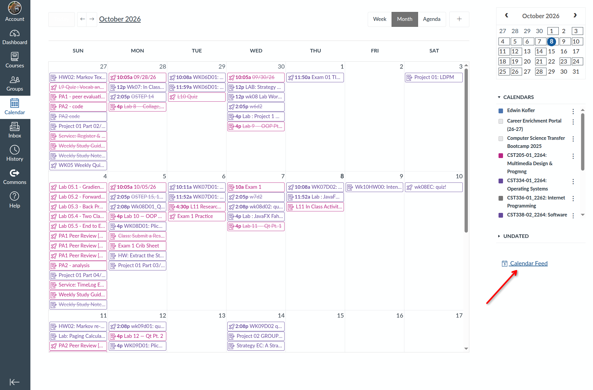
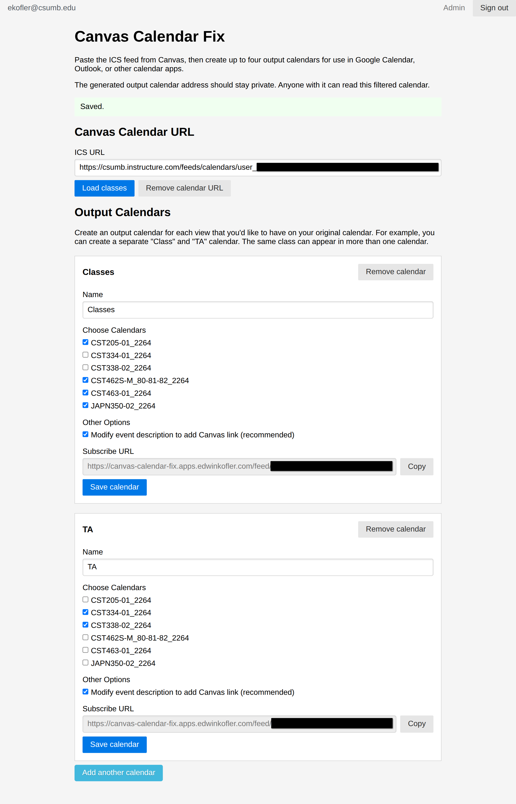

# Canvas Calendar Fix

See an early demo video (may be outdated): https://www.tella.tv/video/canvas-calendar-fix-9s5n.

## Motivation

As mentioned in the video, Canvas, a popular LMS (Learning Management System) solution, has a page that shows all assignments for classes currently being taken.

The web page allows for toggling the visibility of calendars, but I much prefer viewing everything in Google Calendar; however, Canvas only provides 1 exportable calendar feed (shown by red arrow in below image):

Since my classes on Canvas both include courses I'm actually taking and courses that I am TA'ing (teacher assisting), I would prefer to exclude courses that I am TA'ing from the calendar view to reduce the number of irrelevant assignments and classes that show up on my calendar.

So, I needed a way to be able to create a subset of classes and create an output calendar feed just for each subset of classes. That's why I created "Canvas Calendar Fix". The UI looks like this:

.

For a more detailed overview, check out the Tella video at the top. But as the screenshot shows, I can select classes (excluding the ones I am TA'ing for), and have a separate calendar link.

## Human Value

This website is clearly vibe-coded, but I made specific adjustments that AI didn't automatically do:

- The styling be done with [Pure.css](https://pure-css.github.io/) so that it doesn't look vibe coded. I personally prefer its "old" look.
- To have zero front-end JavaScript. All human-computer interaction can be implemented with the simple HTML forms interface, since it's a simple app.
- I use Node.js, pnpm, [Drizzle ORM](https://orm.drizzle.team/) with SQLite because I prefer those solutions for a small application; website is deployed on [Fly](https://fly.io/).
- Authentication follows the "magic link" pattern, implemented with [better-auth](https://better-auth.com) and [Resend](https://resend.com/). I try to avoid passwords and other sensitive user data as much as possible.
- A bunch of miscellaneous cleanup of the AI code.
